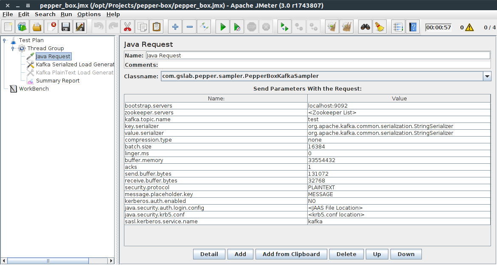
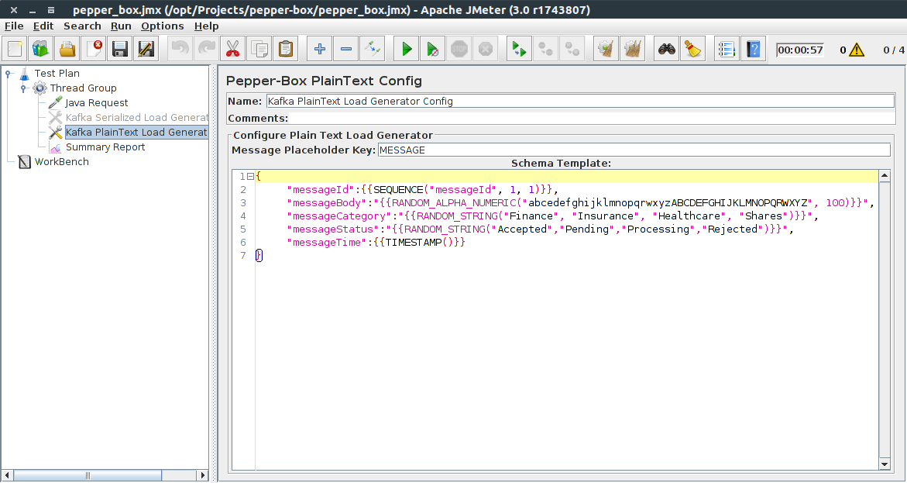
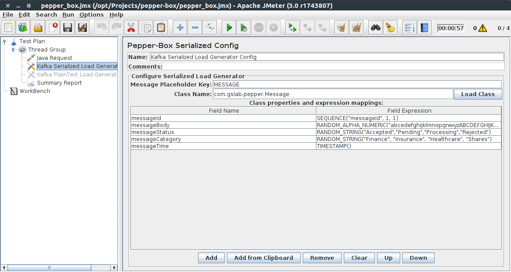

# Pepper-Box - Kafka Load Generator

[](https://travis-ci.org/GSLabDev/pepper-box) [](https://coveralls.io/github/GSLabDev/pepper-box?branch=master)

___

Pepper-Box is kafka load generator plugin for jmeter. It allows to send kafka messages of type plain text(JSON, XML, CSV or any other custom format) as well as java serialized objects.

## Getting Started
___

Pepper-Box includes four main components

* **PepperBoxKafkaSampler** : This is jmeter java sampler sends messages to kafka.
* **Pepper-Box PlainText Config** : This jmeter config element generates plaintext messages based on input schema template designed.
* **Pepper-Box Serialized Config** : This jmeter config element generates serialized object messages based on input class and its property configurations.
* **PepperBoxLoadGenerator** : This is standalone utility which can be used without jmeter.

### Setup
___

#### Requirement

Pepper-Box uses Java 8 with java compiler API, hence on JMeter machine JDK 8 should be installed instead of JRE 8.

Install openjdk on Debian, Ubuntu, etc.,
```
sudo apt-get install openjdk-8-jdk
``` 

Install openjdk on Fedora, Oracle Linux, Red Hat Enterprise Linux, etc.,
```
su -c "yum install java-1.8.0-openjdk-devel"
``` 
For windows you can download oracle JDK 8 setup from [here](http://www.oracle.com/technetwork/java/javase/downloads/jdk8-downloads-2133151.html)

#### Build Project
```
mvn clean install -Djmeter.version=3.0 -Dkafka.version=0.9.0.1
```
JMeter and Kafka version can be passed dynamically.

Once build is completed, copy jar file to JMETER_HOME/lib/ext directory.

### PepperBoxKafkaSampler
___

This is java sampler hence in ThreadGroup add sampler as Java Request and select class as com.gslab.pepper.sampler.PepperBoxKafkaSampler



As you can see in above screen, you can configure producer properties and topic details.

* **bootstrap.servers** : broker-ip-1:port, broker-ip-2:port, broker-ip-3:port
* **zookeeper.servers** : zookeeper-ip-1:port, zookeeper-ip-2:port, zookeeper-ip-3:port. **Note** : Any one of bootstrap or zookeeper server detail is enough. if zookeeper servers are given then bootstrap.servers are retrieved dynamically from zookeeper servers.
* **kafka.topic.name** : Topic on which messages will be sent
* **key.serializer** : Key serializer (This is optional and can be kept as it is as we are not sending keyed messages).
* **value.serializer** : For plaintext config element value can be kept same as default but for serialized config element, value serializer can be "com.gslab.pepper.input.serialized.ObjectSerializer"
* **compression.type** : kafka producer compression type(none/gzip/snappy/lz4)
* **batch.size** : messages batch size(increased batch size with compression like lz4 gives better throughput)
* **linger.ms** : How much maximum time producer should wait till batch becomes full(should be 5-10 when increased batch size and compression is enabled)
* **buffer.memory** : Total buffer memory for producer.
* **acks** : Message sent acknowledgement, value can be (0/1/-1).
* **send.buffer.bytes** : The size of the TCP send buffer (SO_SNDBUF) to use when sending data. If the value is -1, the OS default will be used.
* **receive.buffer.bytes** : The size of the TCP receive buffer (SO_RCVBUF) to use when reading data. If the value is -1, the OS default will be used.
* **security.protocol** : kafka producer protocol. Valid values are: PLAINTEXT, SSL, SASL_PLAINTEXT, SASL_SSL.
* **message.placeholder.key** : Config element message variable name. This name should be same as message placeholder key in serialized/plaintext config element.
* **kerberos.auth.enabled** : YES/NO if it is disabled all below properties will be ignored
* **java.security.auth.login.config** : jaas.conf of kafka Kerberos
* **java.security.krb5.conf** : Kerberos server krb5.conf file
* **sasl.kerberos.service.name** : Kafka Kerberos service name

Above properties are added by default in sampler as those are more significant in terms of performance in most of the cases. But you can add other non listed kafka properties with prefix "_".

For example to enable SSL properties you can add below properties

```
_ssl.key.password
_ssl.keystore.location
_ssl.keystore.password
_ssl.truststore.location
_ssl.truststore.password

```
### Pepper-Box PlainText Config
___

Pepper-Box PlainText Config is jmeter config element. It takes schema template is input and generates message for each sampler request.



You can add this config element using Thread group --> Add --> Config Element --> Pepper-Box PlainText Config

Input schema template can be in any format

**JSON schema template**
```
{
	"messageId":{{SEQUENCE("messageId", 1, 1)}},
	"messageBody":"{{RANDOM_ALPHA_NUMERIC("abcedefghijklmnopqrwxyzABCDEFGHIJKLMNOPQRWXYZ", 100)}}",
	"messageCategory":"{{RANDOM_STRING("Finance", "Insurance", "Healthcare", "Shares")}}",
	"messageStatus":"{{RANDOM_STRING("Accepted","Pending","Processing","Rejected")}}",
	"messageTime":{{TIMESTAMP()}}
}
```

**XML schema template**
```xml
<message>
	<messageId>{{SEQUENCE("messageId", 1, 1)}}</messageId>
	<messageBody>{{RANDOM_ALPHA_NUMERIC("abcedefghijklmnopqrwxyzABCDEFGHIJKLMNOPQRWXYZ", 100)}}</messageBody>
	<messageCategory>{{RANDOM_STRING("Finance", "Insurance", "Healthcare", "Shares")}}</messageCategory>
	<messageStatus>{{RANDOM_STRING("Accepted","Pending","Processing","Rejected")}}</messageStatus>
	<messageTime>{{TIMESTAMP()}}</messageTime>
</message>
```
**Custom schema template**

```
Hello {{FIRST_NAME()}}

	This is sample message sending at {{DATE("dd/MM/yyyy HH:mm:ss")}}.

Thanks and Regards,
{{FIRST_NAME()}} {{LAST_NAME()}}

```

### Pepper-Box Serialized Config
___

Java serialized objects can be sent to kafka using Pepper-Box Serialized Config Element. This config element can be added using Thread group --> Add --> Config Element --> Pepper-Box Serialized Config



Follow below steps to use this config element,

* Enter fully qualified name in `class name` section (e.g. com.gslab.pepper.Message in above screen). This class should be present in jmeter classpath folder(lib or lib/ext). You can copy jar containing required class to JMETER_HOME/lib/ext folder.
* Click on load button which will populate all fields of given class with default values as `Ignore` means field value will not set.
* Assign function expression to each field.

Example Class,

```java
package com.gslab.pepper;
import java.io.Serializable;
public class Message  implements Serializable{

    private long messageId;
    private String messageBody;
    private String messageStatus;
    private String messageCategory;
    private long messageTime;

    public long getMessageId() {
        return messageId;
    }

    public void setMessageId(long messageId) {
        this.messageId = messageId;
    }

    public String getMessageBody() {
        return messageBody;
    }

    public void setMessageBody(String messageBody) {
        this.messageBody = messageBody;
    }

    public String getMessageStatus() {
        return messageStatus;
    }

    public void setMessageStatus(String messageStatus) {
        this.messageStatus = messageStatus;
    }

    public String getMessageCategory() {
        return messageCategory;
    }

    public void setMessageCategory(String messageCategory) {
        this.messageCategory = messageCategory;
    }

    public long getMessageTime() {
        return messageTime;
    }

    public void setMessageTime(long messageTime) {
        this.messageTime = messageTime;
    }
}

```

**Please make sure that function return type and field data type should be compatible with each other.**

### PepperBoxLoadGenerator

PepperBoxLoadGenerator is console plaintext load generation utility.

Command,

```
java -cp pepper-box-1.0.jar  com.gslab.pepper.PepperBoxLoadGenerator --schema-file <schema file absolute path> --producer-config-file <producer properties absoulte path>  --throughput-per-producer <throughput rate per producer> --test-duration <test duration in seconds> --num-producers <number of producers>
```
Example

* Schema file

```
{
	"messageId":{{SEQUENCE("messageId", 1, 1)}},
	"messageBody":"{{RANDOM_ALPHA_NUMERIC("abcedefghijklmnopqrwxyzABCDEFGHIJKLMNOPQRWXYZ", 100)}}",
	"messageCategory":"{{RANDOM_STRING("Finance", "Insurance", "Healthcare", "Shares")}}",
	"messageStatus":"{{RANDOM_STRING("Accepted","Pending","Processing","Rejected")}}",
	"messageTime":{{TIMESTAMP()}}
}
```
* producer properties file

```
bootstrap.servers=<Broker List>
zookeeper.servers=<Zookeeper List>
kafka.topic.name=<kafka topic>
key.serializer=org.apache.kafka.common.serialization.StringSerializer
value.serializer=org.apache.kafka.common.serialization.StringSerializer
acks=0
send.buffer.bytes=131072
receive.buffer.bytes=32768
batch.size=16384
linger.ms=0
buffer.memory=33554432
compression.type=none
security.protocol=PLAINTEXT
kerberos.auth.enabled=NO
java.security.auth.login.config=<JAAS File Location>
java.security.krb5.conf=<krb5.conf location>
sasl.kerberos.service.name=<Kerberos service name>
```
For schema file and producer properties file most of the features same as jmeter plain text config element.

**We have also included ```pepper_box.jmx``` jmeter sample test file which can be directly imported in jmeter.**

### Schema Template Functions
___

Pepper-Box provides various template functions for random data generation,

| Function | Details | Example(For serialized use without `{{ }}`) | Returns |
|----------|:-------:|:--------:|:--------:|
|TIMESTAMP()|current time in long|```{{TIMESTAMP()}}```|Long|
|TIMESTAMP(startDate, endDate)|Random long date between two Dates|```{{TIMESTAMP("01-05-1998 10:30:12","03-03-2017 12:12:12")}}```|Long|
|DATE(format)|current date with given format |```{{DATE("dd-MM-yyyy HH:mm:ss")}}```|String|
|RANDOM_STRING(string1, string2, string3,...)|Random string among given|```{{RANDOM_STRING("ONE","TWO","THREE","FOUR")}}```|String|
|RANDOM_INT(int1, int2, int3,...)|Random integer among given|```{{RANDOM_INT(1, 2, 3, 4)}}```|Integer|
|RANDOM_FLOAT(float1, float2, float3,...)|Random float among given|```{{RANDOM_FLOAT(1.1F ,2.1F, 3.1F, 4.1F)}}```|Float|
|RANDOM_DOUBLE(double1, double2, double3,...)|Random double among given|```{{RANDOM_DOUBLE(1.1, 2.1, 3.1, 4.1)}}```|Double|
|RANDOM_LONG(long1, long2, long3,...)|Random long among given|```{{RANDOM_LONG(1, 2, 3, 4)}}```|Long|
|RANDOM_INT_RANGE(min, max)|Random integer among given|```{{RANDOM_INT_RANGE(1,100)}}```|Integer|
|RANDOM_FLOAT_RANGE(min, max)|Random float between min and max|```{{RANDOM_FLOAT_RANGE(1.0F, 100.0F)}}```|Float|
|RANDOM_FLOAT_RANGE(min, max)|Random double between min and max|```{{RANDOM_FLOAT_RANGE(1.0, 100.0)}}```|Double|
|RANDOM_LONG_RANGE(min, max)|Random long between min and max|```{{RANDOM_LONG_RANGE(1,100)}}```|Long|
|FIRST_NAME()|Random first name|```{{FIRST_NAME()}}```|String|
|LAST_NAME()|Random last name|```{{LAST_NAME()}}```|String|
|RANDOM_ALPHA_NUMERIC(charSet, length)|Random string of given length from given char set|```{{RANDOM_ALPHA_NUMERIC("abcdefghijklmn", 10)}}```|String|
|UUID()|Random UUID|```{{UUID()}}```|String|
|SEQUENCE(sequenceId, startValue, incrementBy)|Generates incremental sequence|```{{SEQUENCE("messageId", 1, 1)}}```|Long|
|PHONE()|Random 10 digit phone number|```{{PHONE()}}```|String|
|GENDER()|Random gender|```{{GENDER()}}```|String|
|BOOLEAN()|Random boolean|```{{BOOLEAN()}}```|boolean|
|EMAIL(domain)|Random email id for given domain|```{{EMAIL("test.com")}}```|String|
|USERNAME()|Random username|```{{USERNAME()}}```|String|
|IPV4()|Random IPV4 address|```{{IPV4()}}```|String|
|IPV6()|Random IPV6 address|```{{IPV6()}}```|String|

### Custom Functions
Apart from these functions, you can also add your own custom function in `com.gslab.pepper.input.CustomFunctions` class. Please make sure that those are static functions.

Example

```java

public static float AVG(float... floats){
        int count = floats.length;
        float sum = 0.0;
        for (float number : floats){
            sum += number;
        }
        return sum/count;
    }

```
AVG function can be used in schema as shown below,

```{{AVG(32.2, 34.5, 64.2)}}```

**Note:** While writing custom functions, please try to keep data in memory or scale your function as much other functions otherwise your custom function itself becomes performance bottlneck. e.g. you need some record ids from RDBMS for some schema fields, instead of querying every time bring all ids inmemory and get random id from those ids.

You can also add manipulations on template functions, for example TIMESTAMP() function returns time in milliseconds but you can get time in seconds,

```
{{java.util.concurrent.TimeUnit.MILLISECONDS.toSeconds(TIMESTAMP())}}

```

## Special Thanks!

* We would like to special thanks to [kafkameter
](https://github.com/BrightTag/kafkameter) and [wrtting custom jmeter plugin](http://codyaray.com/2014/07/custom-jmeter-samplers-and-config-elements) blogpost which helped to understand writing custom plugins for JMeter.

* We also like to thanks to [InMemoryJavaCompiler](https://github.com/trung/InMemoryJavaCompiler) which helped to understand in memory code compilation.
